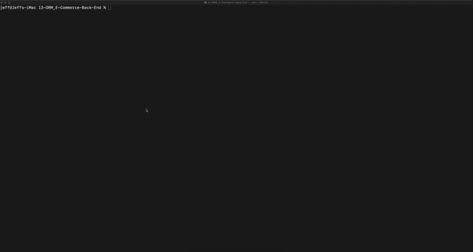

# 13-ORM_E-Commerce-Back-End

This is the backend of the E-commerce site that we were provided. To use please use insomnia to see the Get,Put,Post,Delete in the mysql db. 

# Table of Contents

|                               |                         |
| ----------------------------- | ----------------------- |
| [GitHub Links](#github-links) | [Questions](#questions) |
| [Installation](#installation) | [License](#license)     |
| [Test](#test)                 | [Credits](#credits)     |
| [Usage](#usage)               |                         |
|                               |                         |

# Installation

Open terminal/gitbash and run the following:

```
  npm install
```

## Usage

To start please run the following in terminal/gitbash:

```
  mysql -u "your username" -p / enter your password / source db/schema.sql /quit
```
```
  npm run seed
```
```
  npm start
```

## Here is a preview of E-Commerce Back End!



# GitHub Links

Project Video [Link](https://drive.google.com/file/d/1b16moiJugGUC4ohhFJbffTtxnSgoDb7z/view?usp=sharing)<br>
Project Repository [Link](https://github.com/jeffcela/13-ORM_E-Commerce-Back-End)

## Questions

Please direct any questions to jeffcela@gmail.com

# Contributing

Please refer to each project's style and contribution guidelines for submitting patches and additions. In general, we follow the "fork-and-pull" Git workflow.

1. Fork the repo on GitHub
2. Clone the project to your own machine
3. Commit changes to your own branch
4. Push your work back up to your fork
5. Submit a Pull request so that we can review your changes

# Credits

_This homework assignment was completed in VS Code and Terminal by Jeff Cela on the day of 11/14/2021_
© 2021 Trilogy Education Services, LLC, a 2U, Inc. brand. Confidential and Proprietary. All Rights Reserved.

# License

[](https://shields.io)
